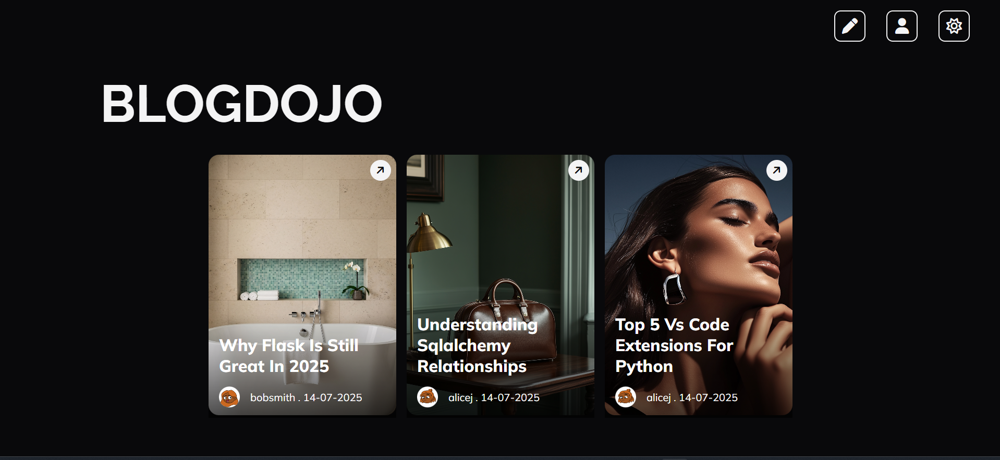

# 🧘‍♂️ BlogDojo

BlogDojo is a simple yet elegant blog web application built with **Flask** and **SQLite**. Designed as a personal learning project, BlogDojo lets users create, edit, and view rich-text blog posts using a Quill-powered editor. This project is open-source and will continue evolving as more features are added.

 <!-- Optional: Add an actual screenshot here -->

---

## 🚀 Live Demo

🔗 Live Website: [https://blogdojo.onrender.com](https://blogdojo.onrender.com)

---

## 🧠 Overview

BlogDojo focuses on enhancing practical full-stack development skills using:

- 🧱 Flask for backend & routing
- 📦 SQLite for local relational data
- ✍️ QuillJS for rich blog editing
- 📷 Image uploading
- 🔐 Session-based login
- 🌗 Theme toggling (light/dark)
- 👤 Profile page for managing your posts

---

## ✨ Features

- 📝 **Rich Blog Creation** using Quill
- 🖼️ **Image Upload** support
- 🔒 **User Authentication** (signup/login)
- 🗃️ **View All Blogs** on Home Page
- 👤 **Profile Page** to view your posts
- 🛠️ **Edit/Delete Posts**
- 🎨 **Light/Dark Mode** (stored in `localStorage`)
- 🧰 Secure forms with CSRF protection
- 📄 Dynamic HTML rendering with Jinja2
- ✅ Password hashing with Werkzeug

---

## 🛠️ Tech Stack

| Layer        | Tech                      |
|--------------|---------------------------|
| Backend      | Python, Flask             |
| Database     | SQLite + SQLAlchemy       |
| Frontend     | HTML, CSS, JS, QuillJS    |
| Auth         | werkzeug + Sessions       |
| Deployment   | Render.com                |

---

## 📦 Installation

Clone the repo and install dependencies:

```bash
git clone https://github.com/Thunderer9506/blogdojo.git
cd blogdojo
python -m venv venv
source venv/bin/activate   # or venv\Scripts\activate on Windows
pip install -r requirements.txt
```

---

## ⚙️ Running Locally

```bash
flask run
```

Visit [http://localhost:5000](http://localhost:5000)

---

## 🔐 Environment Variables

Create a `.env` or set them in your OS/Render:

| Variable                         | Purpose              |
|----------------------------------|----------------------|
| `SECRET_KEY`                     | Session encryption   |
| `SQLALCHEMY_DATABASE_URI`        | Database Link/URI    |
| `SQLALCHEMY_TRACK_MODIFICATIONS` | False                |

---

## 📁 Folder Structure

```
blogdojo/
│
├── app.py                    # Main Flask app
├── db.py                     # Database setup and models
├── templates/                # Jinja2 HTML templates
    |── macros/             
├── static/                   # CSS, JS, images
    |── css/
    |── js/
    |── images/                 
├── utils/                    # Utility functions (ID generation, etc.)
├── requirements.txt          # Python dependencies
└── README.md                 # You're here
```

---

## 🧪 Optional Test Users

If needed, you can populate the database with test users using the provided `app_context()` block in `app.py`.

---


## 🛡️ Security Practices

- Passwords are **hashed** using `werkzeug.security`
- File uploads are validated and restricted to server memory
- Jinja2 templates use the `|safe` filter **only** after HTML sanitization

---

## 🤝 Contributing

Want to improve BlogDojo? Fork the repo and submit a PR!

```bash
git clone https://github.com/your-username/blogdojo.git
git checkout -b new-feature
```

Open a pull request with clear changes.

---

## 📜 License

MIT License © 2025 [Shaurya Srivastava]

---
